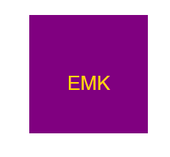

# Emblem Mark

Generate simple SVG logos from the command line, perfect for developers who need a quick logo without the design hassle.

## Features

- User prompts for text, text color, shape, and shape color.
- Supported shapes: Triangle, Circle, Square.
- Outputs an SVG file named logo.svg.

## Installation

1. Clone repository:
```
git clone https://github.com/adini6/emblem-mark.git

```

2. Navigate to the project directory:
```
cd emblem-mark

```

3. install the required dependencies:
```
npm install
```
[Walk through video](https://drive.google.com/file/d/1mkXVbyRAiIimXN_0DKim7FZZgNDHiSs0/view)
## Usage

1. Run the logo generator:
```
node index.js
```
2. Answer the prompted questions.

3. After completing the prompts, the SVG logo will be saved as logo.svg in the project directory.

4. Open the logo.svg file in a web browser to view your generated logo.



## Testing

To run tests: 
```
npm test
```

## License 

This project is licensed under the MIT License.

## Questions

If you have any questions or insights, feel free to reach out via [email](mailto:adini18@gmail.com) or through my [github](https://github.com/adini6) profile. 